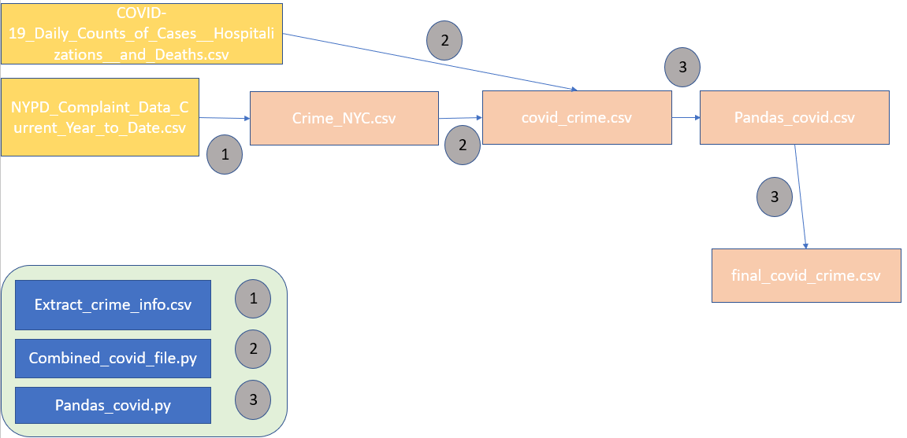
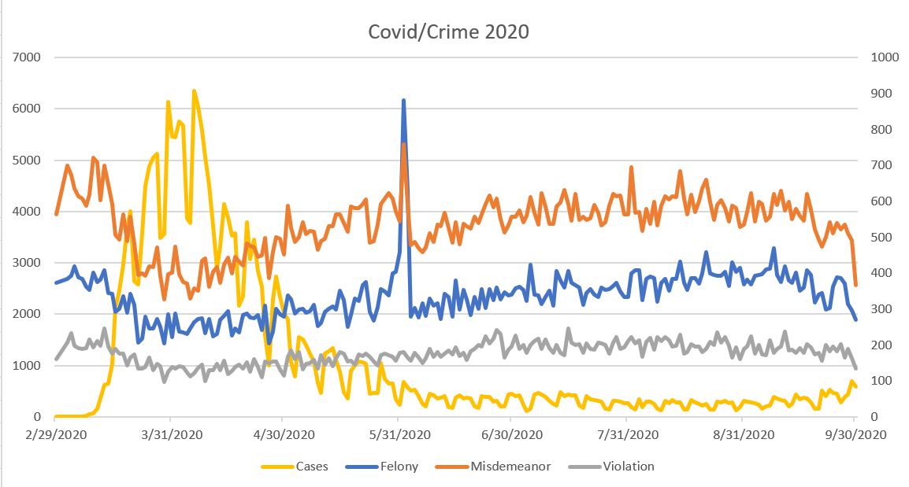
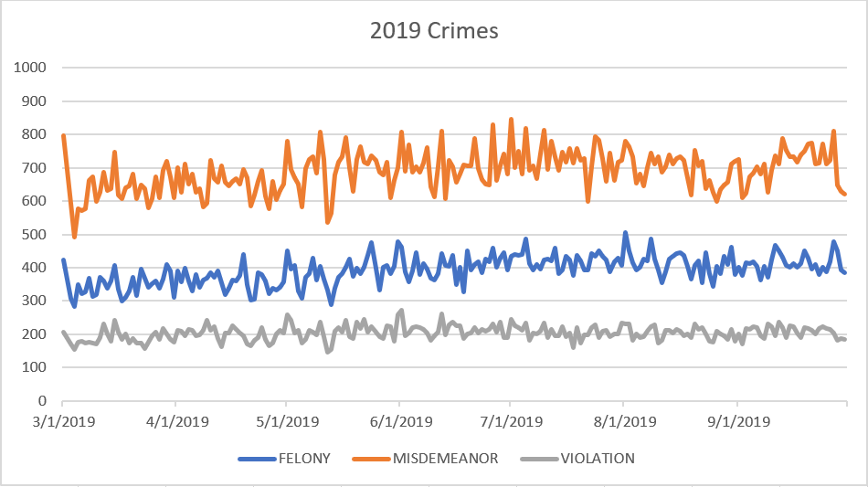

# Final Project - COVID-19 impact on crimes rates in NYC

## Overview

To complete this project, I needed three different data sources, each from the NYC Open Data site. I needed the COVID-19 cases data, the 2020 Crime data, and the Historic Crime data. In total, I used six separate Python files and ten different csv files. I will discuss the progression in this document. 

Instead of making many requests to the NYPD API as I tried to figure out the coding for getting the data I needed, I decided to download the three files which I needed from the NYC site as CSV files. This would allow me to work with them as much as I needed.

##Stage 1

My first goal was to create a csv file which held the crime information for NYC together with the date and the case count. Optimally, this crime information would have been sorted by crime categories: Felony, Misdemeanor, and Violation. Below, I have included a workflow diagram of how I completed this task. 



### Crime NYC

The NYPD Complaint Data csv held all crime data for the past year and held about 35 columns worth of data. Since I only needed the date information and the crime information, I used the Extract_crime_info.csv to extract this data to a new file. 

Here, I used the csv reader code to extract the two rows which I needed and write them to a new file. 

```python
for row in reader:
    iwant = []
    date = str(row[3])
    crime = str(row[13])
    
    iwant = [date, crime]
    
    writer.writerow(iwant)
```


### Covid Crime csv

Next, I wanted to create a file which only contained the crime data for the dates where COVID-19 was present in NYC. First, I opened the COVID-19_Daily_Counts file, iterated through it, and made a list dictionaries in the file where the dictionary key was the date and the dictionary value was the number of positive tests on that date. 

```python
covid_list_dic = []

for row in reader:
    if n > 0:
        dic = {}
        dat = row[0].split(" ")[0]
        if str(dat[0]) == '0':
            covdate = dat[1:]
        
            dic[covdate] = str(row[1])
            covid_list_dic.append(dic)
    n += 1
print(covid_list_dic)
```

Then, I opened a Crime_NYC.csv which I had just created and interated through each row. Here, I look for instances were the date in the Crime_NYC file matched a key in one of the dictionaries above. If so, then I would write the date, the crime, and the dictionary value as row in the new file, covid_crime.csv. 

```python
for row in csv_reader1:
    if n > 0:
        for dicti in covid_list_dic:
            try:
                date = row[0]
                if str(date[0]) == '0':
                    date = date[1:]
                    if str(date) in dicti.keys():
                        date = str(date)
                        row.append(dicti[date])
                        
                        csv_writer.writerow(row) 
            except Exception as e:
                a = str(e)
    n += 1
```

### Pandas_covid and final_covid_crime.csv

Next, I wanted the crimes Felony, Misdeamor, and Violations to be in their own columns, and I used the pandas module for this since I found it easier, creating the pandas_covid.csv in the process. However, I came across a problem. When I used pandas module, my Cases column disappeared and I could not figure out how to keep the Cases column when using the pandas module. As a result, I had to add the Cases column a second time, using the same process as before, and creating a new csv file, the final_covid_crime.csv.

Below is an example of the first couple rows of the pandas_covid.csv file:

 Date | FELONY | MISDEMEANOR | VIOLATION 
--------- | ------------ | ------------- | ------------- 
2/29/2020 | 374 | 564 | 161
3/3/2020 | 384 | 699 | 206

Here is a sample of the final_covid_crime.csv:

Date | Felony | Misdemeanor | Violation | Cases

--------- | ------------ | ------------- | ------------- | -------------
2/29/2020 | 374 | 564 | 161 | 1
3/3/2020 | 384 | 699 | 206 | 1

### Visual

Below, I have created a visual of the data that I have created thusfar in the project. On the left y-axis, we have the number of Covid cases, and on the right y-axis, we have the crime amounts. We notice a clear decrease in crimes as COVID-19 virus began its initial surge in NYC. Additionally, we notice a spike in crimes on June 1 due to the George Floyd protests. 



## Stage 2

My second goal was to be able to visualize the differences in crime between this 2020 and the corresponding 2019 dates. Below, I have included a visualization of the workflow for this second stage in the project. 


### Crime NYC 2019

This csv file includes the 2019 crimes and dates. I iterated through the NYPD_Complaint_Data_Historic file and chose only 2019 dates, because the historic complaint file was so large, it would take considerably longer to use this file if I made mistakes in my code. So, I create a new csv file, Crime_NYC_2019 with only the 2019 dates because it would be more manageable.

###Crime NYC 2019 Covid Date file and the Pandas covid 2019 file

Here I append all the COVID dates to a list by iterating through the final_covid_crime.csv file. Then, I iterate through the Crime_NYC_2019.csv file, writing the date and the crime to a new file if the date in 2019 corresponds to the 2020 date. 

```python

for row in reader:
    if n > 0:
        
        date = row[0][0:6]+'2020'
      
        if date in covid_dates:
            date = row[0]
            crime = row[1]
           
            iwant = [date, crime]
            writer.writerow(iwant) 
    n+=1   
```

Lastly, to get each crime category in its own column, I had to use pandas once again. 


### Visual 





If we compare these two visualizations side-by-side:

![Crime Comparison](images/Crime-Comparison.PNG

There is a noticeable difference in the crime rates for these two years. Even after the initial surge of COVID, the misdemeanors remain low when compared to 2019 crime rates. 

