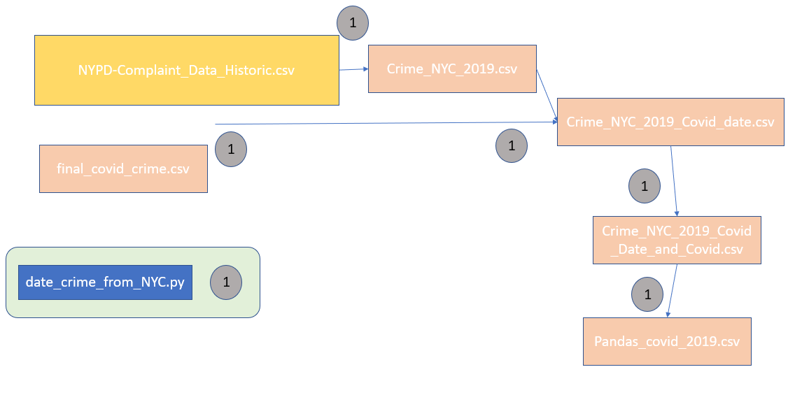

# Final Project - COVID-19 impact on crimes rates in NYC

## Overview

To complete this project, I needed three different data sources, each from the NYC Open Data site. I needed the COVID-19 cases data, the 2020 Crime data, and the Historic Crime data. In total, I used six separate Python files and ten different csv files. I will discuss the progression in this document. 

Instead of making many requests to the NYC API as I tried to figure out the coding for getting the data I needed, I decided to download the three files which I needed from the NYC site as CSV files. This would allow me to work with them as much as I needed. Additionally, it should be noted that the most current NYPD Crime data only covers until September 30 and the earliest COVID data in the NYC website is on February 29, so these two dates will serve as my boundaries for this project. 

## Stage 1

My first goal was to create a csv file which held the crime information for NYC together with the date and the case count. Optimally, this crime information would have been sorted by crime categories: Felony, Misdemeanor, and Violation. Below, I have included a workflow diagram of how I completed this task. 


### Crime NYC

The NYPD Complaint Data csv held all crime data for the past year and held about 35 columns worth of data. Since I only needed the date information and the crime information, I used the Extract_crime_info.csv to extract this data to a new file. 

Here, I used the csv reader code to extract the two rows which I needed and write them to a new file. 

Additionally, in this code, you will notice me slicing the date and putting it back together in a couple ways. I did this because NYC database saves dates in this format '03/04/2020', for example. But later, I discovered that pandas cannot function on a value of it begins with a zero. So, I had to go back through all my files and correct this issue by removing the zeros. While doing so, I also decided to remove the zeros from the day as well, just for completeness. You will see this slicing happen several times through the files since I had to read from the NYC files more than once. 

```python
for row in reader:
    iwant = []
    
    date = str(row[3])
   
    if date[3] == '0':
        date = date[0:3] + date[4:]
    if date[0] == '0':
        date = date[1:]
       
    crime = str(row[13])
    
    iwant = [date, crime]
    
    writer.writerow(iwant)
    
    n+=1
```


### Covid Crime csv

Next, I wanted to create a file which only contained the crime data for the dates where COVID-19 was present in NYC. First, I opened the COVID-19_Daily_Counts file, iterated through it, and made a list dictionaries in the file where the dictionary key was the date and the dictionary value was the number of positive tests on that date. 

```python
covid_list_dic = []

for row in reader:
    if n > 0:
        dic = {}
        dat = row[0].split(" ")[0]
        if dat[3] == '0':
            dat = dat[0:3] + dat[4:]
        if str(dat[0]) == '0':
            covdate = dat[1:]
        
            dic[covdate] = str(row[1])
            covid_list_dic.append(dic)
    n += 1
```

Then, I opened a Crime_NYC.csv which I had just created and interated through each row. Here, I look for instances were the date in the Crime_NYC file matched a key in one of the dictionaries above. If so, then I would write the date, the crime, and the dictionary value as row in the new file, covid_crime.csv. 

```python
for row in csv_reader1:
    if n > 0:
        for dicti in covid_list_dic:
            date = row[0]
            if date in dicti.keys():
                date = str(date)
                row.append(dicti[date])
                csv_writer.writerow(row) 
    n += 1
```

### Pandas_covid and final_covid_crime.csv

Next, I wanted the crimes Felony, Misdeamor, and Violations to be in their own columns, and I used the pandas module for this since I found it easier, creating the pandas_covid.csv in the process. However, I came across a problem. When I used pandas module, my Cases column disappeared and I could not figure out how to keep the Cases column when using the pandas module. As a result, I had to add the Cases column a second time, using the same process as before, and creating a new csv file, the final_covid_crime.csv.

Below is an example of the pandas code and the first couple rows of the pandas_covid.csv file:

```python
import pandas as pd
coviddata = pd.read_csv('covid_crime.csv','r',delimiter = ',')

reshape = pd.pivot_table(coviddata, index = ['Date'], columns = 'Crimes',values = 'Cases', aggfunc='count')

reshape.to_csv('pandas_covid.csv')
```

 Date | FELONY | MISDEMEANOR | VIOLATION 
--------- | ------------ | ------------- | ------------- 
2/29/2020 | 374 | 564 | 161
3/3/2020 | 384 | 699 | 206

Here is a sample of the final_covid_crime.csv:

 Date | FELONY | MISDEMEANOR | VIOLATION | Cases
--------- | ------------ | ------------- | ------------- | -------------
2/29/2020 | 374 | 564 | 161 | 1
3/3/2020 | 384 | 699 | 206 | 1

### Visual

Below, I have created a visual of the data that I have created thusfar in the project. On the left y-axis, we have the number of Covid cases, and on the right y-axis, we have the crime amounts. We notice a clear decrease in crimes as COVID-19 virus began its initial surge in NYC. Additionally, we notice a spike in crimes on June 1 due to the George Floyd protests. 


## Stage 2

My second goal was to be able to visualize the differences in crime between 2020 and the corresponding 2019 dates. Below, I have included a visualization of the workflow for this second stage in the project. 




### Crime NYC 2019

This csv file includes the 2019 crimes and dates. I iterated through the NYPD_Complaint_Data_Historic file and chose only 2019 dates, because the historic complaint file was so large, it would take considerably longer to use this file if I made mistakes in my code. So, I create a new csv file, Crime_NYC_2019 with only the 2019 dates because it would be more manageable.

```python
for row in reader:
    if '2019' in row[1][6:]:
        date = str(row[1])
        crime = str(row[12])
       
        iwant = [date, crime]
        writer.writerow(iwant)
ccdata.close()
```

### Crime NYC 2019 Covid Date file

Here I append all the COVID dates to a list by iterating through the final_covid_crime.csv file. Here, I took the chance to correct the leap year issue in 2020. Since 2020 is a leap year, 2019 does not possess 2/29 date. Thus, I changed the 2/29/2020 date to 3/1/ date because February 29 would be equivalent to March 1 on a non leap year. I did when makeing a list of dates from the final_covid_crime file. 

```python
covid_dates = []
for row in reader:
    if n > 0:
        if '02/29' in row[0]:
            row[0] = '3/1/2020'
        covid_dates.append(row[0])
    n += 1
```


Then, I iterate through the Crime_NYC_2019.csv file, writing the date and the crime to a new file, Crime_NYC_2019_Covid_date.csv, which has the dates in 2019 which correspond to the 2020 dates. The way I made sure the 2019 dates corresponded to the 2020 dates was by takin all the 2019 dates in the file and replacing the year 2019 with the year 2020, then matching these with the COVID dates. Since I changed the date format from '03/06/2019' to '3/10/2019', the length of the date fields became inconsistent. So, I could not change the date just by slicing the date. Instead, I chose to split the date on "/" and put the date back together, adding the 2020 value at the end. 

```python
for row in reader:
    if n > 0:
        splitt = row[0].split("/")
        date = splitt[0] + "/" + splitt[1] + "/" +'2020'
      
        if date in covid_dates:
            date = row[0]
            crime = row[1]
           
            iwant = [date, crime]
            writer.writerow(iwant) 
    n+=1 
```

First few lines of Crime_NYC_2019_Covid_date.csv.

 Date | Crime 
--------- | ------------ 
3/1/2019 | MISDEMEANOR 
3/1/2019 | MISDEMEANOR 


### NYC 2019 Covid Data and Covid Dates file/Pandas covid 2019 file

Lastly, to get each crime category in its own column, I had to use pandas once again. But an interesting issue arose when I used pandas. For some reason, if I tried to use the pandas module with only the Date column and the Crime column, the module would not work. I _had_ to have the COVID values included as a third column before the pandas module would create the file I wanted.

Thus, from the Crime_NYC_2019_Covid_date file described above, I had to create another file, Crime_NYC_2019_Covid_Date_and_Covid file which contain the date, crime, and Covid case information. 

First few lines of Crime_NYC_2019_Covid_Date_and_Covid.csv.

 Date | Crime | Cases
--------- | ------------ | ------------ 
3/1/2019 | MISDEMEANOR | 1
3/1/2019 | MISDEMEANOR | 1

With this file, I was then able to create the pandas_covid_2019.csv file. Which holds the date and crime information for 2019 for dates which correspond to the 2020 COVID dates. 

First few lines look like this:

Date | FELONY | MISDEMEANOR | VIOLATION 
--------- | ------------ | ------------- | ------------- 
3/1/2019 | 422 | 796 | 206
3/3/2020 | 307 | 593 | 171


### Visual 


If we compare these two visualizations side-by-side:


There is a noticeable difference in the crime rates for these two years. Even after the initial surge of COVID, the misdemeanors remain low when compared to 2019 crime rates. 

### Some Analysis

Besides the files visualized in the workflow. I create an additional file name avg-crimes.py to perform some analysis on the data. 

For example, in the file, I calculated the average crimes performed during the COVID period in 2020 and the corresponding dates in 2019. We see that in 2020 there is a significant difference in crime rates with the average misdemeanors going down by almost 22% and felonies and violations both dipping by more than 13%.

 Year | Average Felony | Average Misdemeanor | Average Violation 
--------- | ------------ | ------------- | ------------- 
2019 | 393 | 688 | 204 
2020 | 338 | 537 | 177 
PCT CHG | -13.99 | -21.95 | -13.24


Additionally, when we look at the COVID/Crime 2020 graph we notice large dips. Curious about these, I summed the cases for each of the days of the week. I found that there are significantly less positive COVID tests during the weekend. This is either because testing facilities were not open then or people do not want to get tested on the weekend. 

 Day | Total Cases 
--------- | ------------
Saturday | 24300 
Sunday | 22711
Monday | 38955
Tuesday | 40217
Wednesday | 40085
Thursday | 38251
Friday | 36954  

## Challenges During Project

I remember at the beginning of the semester, my professor said, "80% of the time we spend in a dataset is getting the data how we want, and only about 20% of the time spent in a data set actually goes to analyzing it." I never realized how true this was until this project where I would estimate 95% of my time was spent trying to get the data in a format that was usable, consistent, and repeatable. 

My biggest two issues were:

* Trying to find a way to add columns to a csv _without_ making a new csv file everytime
* Making sure the dates were in a consistent format across all the tiles. 

Unfortunately, I was unsuccessful in finding a solution to the first issue, hence the myriad of csv files included in my project. Near the end, I ended up having to create a workflow (which is displayed above) which allowed me to understand my own process and how these different files were connected.

The second issue I was able to conquer. This issue grew larger than necessary mostly because I was unaware of it until most of the way through my project when only some dates were being written to my files and others were excluded. I had to dig back one by one through my files until I understood where the issue started, and had to rewrite my code to place all the dates in the same format.


 